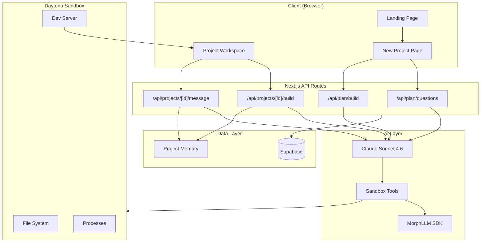
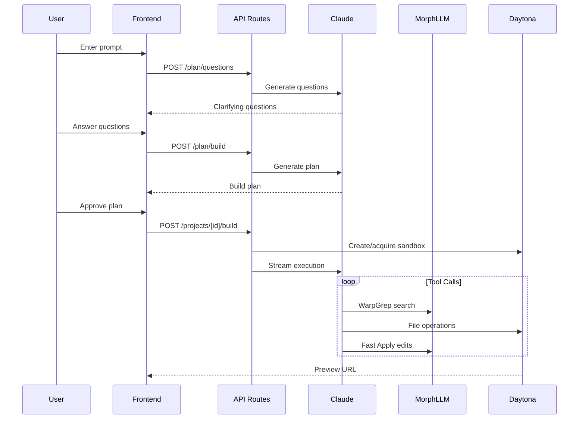
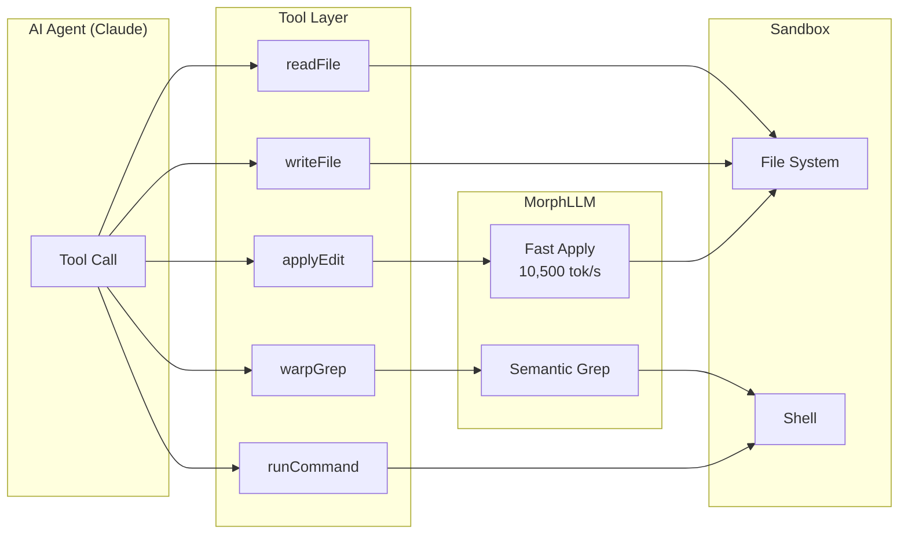
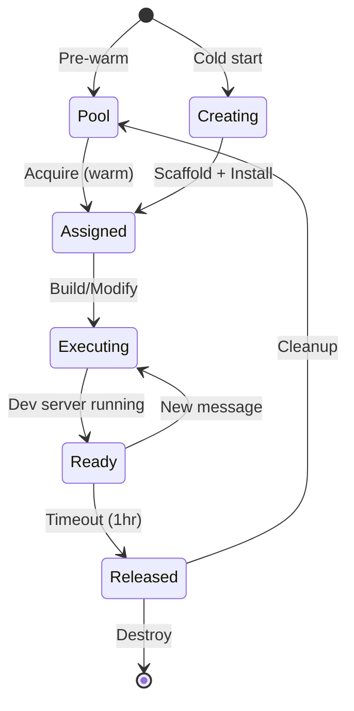
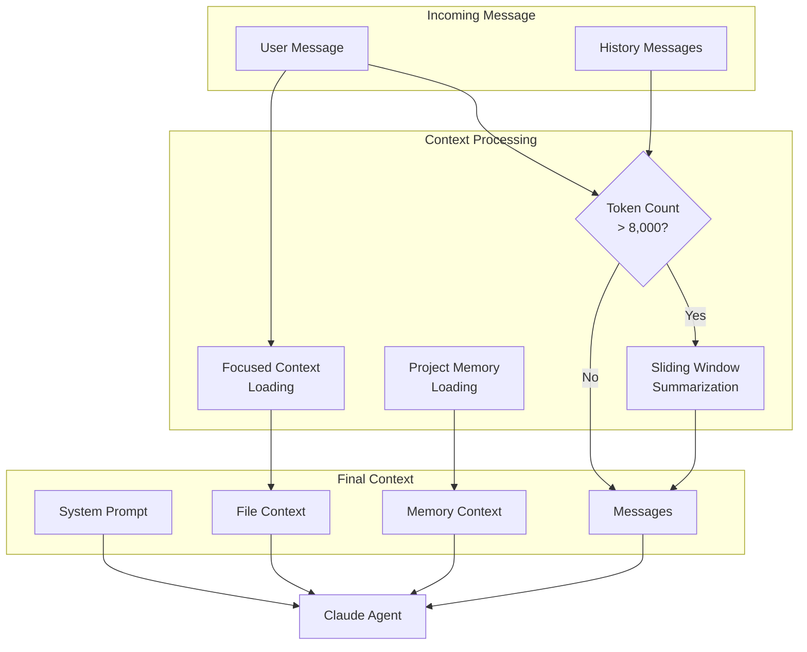

# Pluto AI Web App Builder - Technical Documentation

> Comprehensive technical documentation covering architecture, integrations, and improvement opportunities.

---

## Table of Contents

1. [Architecture Overview](#architecture-overview)
2. [Current State Documentation](#current-state-documentation)
3. [Improvement Opportunities](#improvement-opportunities)
4. [Code Cleanup Recommendations](#code-cleanup-recommendations)

---

## Architecture Overview

### System Architecture



### Request Flow



### Tool Execution Flow



### Sandbox Lifecycle



### Context Management Flow



---

## Current State Documentation

### Tech Stack

| Component | Technology | Version |
|-----------|------------|---------|
| Framework | Next.js (App Router) | 16.2.4 |
| AI SDK | Vercel AI SDK | 6.0.170 |
| AI Provider | @ai-sdk/anthropic | Latest |
| Sandbox | Daytona SDK | 0.187.0 |
| Code Tools | MorphLLM SDK | @morphllm/morphsdk |
| Database | Supabase | PostgreSQL + Auth |
| Frontend | React | 19.2.4 |
| Styling | Tailwind CSS | v4 |
| UI Components | Base UI + shadcn/ui | Latest |
| Validation | Zod | v4 |

### AI Models

| Task | Model | Purpose |
|------|-------|---------|
| All agentic tasks | `claude-sonnet-4-6` | Planning, building, modifications |
| Summarization | `claude-3-5-haiku-20241022` | Fast, cheap conversation summaries |

**Note:** `claude-opus-4-8` is mentioned in CLAUDE.md for coding tasks but currently only Sonnet is used.

### Current MorphLLM Integrations

| Tool | Purpose | Performance | Fallback |
|------|---------|-------------|----------|
| **Fast Apply** | Code merging with `// ... existing code ...` markers | 10,500 tok/s | Direct file write |
| **WarpGrep** | Semantic code search across sandbox | Fast lookup | Keyword-based grep |

**Implementation:** `src/lib/pluto/tools.ts:12-89`

```typescript
// Dynamic import with fallback pattern
async function withMorphFallback<T>(
  morphCall: () => Promise<T>,
  fallback: () => Promise<T>
): Promise<T> {
  if (!process.env.MORPH_API_KEY) return fallback()
  try {
    return await morphCall()
  } catch (error) {
    console.warn('[Morph] Failed, falling back:', error)
    return fallback()
  }
}
```

### Current Context Management

| Feature | Implementation | Location |
|---------|----------------|----------|
| Conversation Compression | Sliding window (6 recent, summarize older) | `src/lib/pluto/conversation.ts` |
| Focused Context | Relevance-scored file loading | `src/lib/pluto/context.ts` |
| Project Memory | Decisions, tasks, issues tracking | `src/lib/memory/memory.ts` |
| File Summaries | AI-generated summaries cached | `src/lib/memory/file-summaries.ts` |

**Compression Config:**
- Recent messages: 6 (kept in full)
- Token threshold: 8,000 tokens
- Summarization model: `claude-3-5-haiku-20241022`

### Sandbox Tools

| Category | Tools |
|----------|-------|
| **File Operations** | `readFile`, `writeFile`, `editFile`, `deleteFile`, `moveFile` |
| **Search** | `searchFiles`, `grep`, `warpGrep` |
| **Code Editing** | `applyEdit` (Morph Fast Apply) |
| **Navigation** | `getFileTree`, `detectProjectType` |
| **Execution** | `runCommand`, `startProcess`, `stopProcess`, `listProcesses`, `getLogs` |
| **Checkpoints** | `createCheckpoint`, `rollbackCheckpoint`, `getDiff` |
| **Build/Test** | `runTests`, `formatCode`, `installDependencies` |
| **Context** | `summarizeProject`, `summarizeFile`, `previewUrl` |
| **Human-in-Loop** | `askUser` |

### Key Directory Structure

```
src/
├── app/api/
│   ├── plan/
│   │   ├── build/          # POST: Generate build plan
│   │   └── questions/      # POST: Generate clarifying questions
│   └── projects/[id]/
│       ├── build/          # POST: Initial build execution
│       ├── message/        # POST: Modification requests
│       ├── files/          # GET: List project files
│       ├── logs/           # GET: Build logs
│       └── preview/        # GET: Preview link
├── lib/
│   ├── ai/models.ts        # Model selection
│   ├── mcp/daytona.ts      # MCP client wrapper
│   ├── daytona/            # Sandbox SDK operations
│   ├── pluto/
│   │   ├── tools.ts        # AI SDK v6 tools
│   │   ├── schemas.ts      # Zod validation
│   │   ├── prompts.ts      # System prompts
│   │   ├── conversation.ts # Compression
│   │   └── context.ts      # Focused context
│   └── memory/             # Project memory
└── types/pluto.ts          # Type definitions
```

---

## Improvement Opportunities

### A. MorphLLM Enhancements

#### 1. Morph Compact Integration

**What:** Context compression at 33,000 tok/s with 50-70% token reduction

**Why:**
- Current summarization loses detail
- Morph Compact preserves verbatim content
- Significant cost reduction on long conversations

**Where:** Replace `src/lib/pluto/conversation.ts`

**Current Implementation:**
```typescript
// src/lib/pluto/conversation.ts
// Uses Haiku for summarization - loses detail
async function compressConversation(messages: UIMessage[]) {
  const summary = await generateText({
    model: anthropic('claude-3-5-haiku-20241022'),
    prompt: `Summarize this conversation...`,
  })
  // Summary loses specific details
}
```

**Proposed Implementation:**
```typescript
// src/lib/pluto/conversation.ts
import { MorphClient } from '@morphllm/morphsdk'

const morph = new MorphClient({ apiKey: process.env.MORPH_API_KEY })

async function compactContext(messages: Message[], query: string) {
  // 33,000 tok/s - 50-70% compression
  const result = await morph.compact({
    input: messages.map(m => m.content).join('\n'),
    query, // What user is asking about
    compressionRatio: 0.5,
    preserveRecent: 3, // Keep last 3 messages verbatim
  })

  return {
    compactedContext: result.output,
    tokensSaved: result.inputTokens - result.outputTokens,
    compressionRatio: result.outputTokens / result.inputTokens,
  }
}

// Usage in conversation.ts
export async function compressConversation(messages: UIMessage[], currentQuery: string) {
  if (!process.env.MORPH_API_KEY) {
    return fallbackSummarization(messages) // Current behavior
  }

  const oldMessages = messages.slice(0, -RECENT_MESSAGES_TO_KEEP)
  const recentMessages = messages.slice(-RECENT_MESSAGES_TO_KEEP)

  const { compactedContext, tokensSaved } = await compactContext(
    oldMessages,
    currentQuery
  )

  return {
    messages: [
      { role: 'system', content: `Previous context:\n${compactedContext}` },
      ...recentMessages,
    ],
    tokensSaved,
    wasSummarized: true,
  }
}
```

**Benefits:**
- 50-70% token reduction (vs ~40% with summarization)
- Preserves exact code snippets and decisions
- 33,000 tok/s processing speed
- Better context quality for follow-up modifications

---

#### 2. Morph Router Integration

**What:** Intelligent model routing based on prompt complexity (~50ms, $0.005/request)

**Why:**
- Use cheaper models for simple tasks
- Route complex tasks to premium models
- Reduce costs while maintaining quality

**Where:** `src/lib/ai/models.ts`

**Current Implementation:**
```typescript
// src/lib/ai/models.ts
export function getModelForTask(taskType: TaskType) {
  // Always uses Sonnet regardless of complexity
  return anthropic('claude-sonnet-4-6')
}
```

**Proposed Implementation:**
```typescript
// src/lib/ai/models.ts
import { MorphClient } from '@morphllm/morphsdk'

const morph = new MorphClient({ apiKey: process.env.MORPH_API_KEY })

type RoutedModel = 'claude-haiku-4' | 'claude-sonnet-4-6' | 'claude-opus-4-8'

interface RouteResult {
  model: RoutedModel
  tier: 'simple' | 'moderate' | 'complex'
  confidence: number
}

async function routeToModel(prompt: string, taskType: TaskType): Promise<RouteResult> {
  if (!process.env.MORPH_API_KEY) {
    return { model: 'claude-sonnet-4-6', tier: 'moderate', confidence: 1 }
  }

  try {
    const result = await morph.router.classify(prompt, {
      context: taskType,
      tiers: {
        simple: { description: 'Basic clarifications, simple file reads' },
        moderate: { description: 'Standard code generation, modifications' },
        complex: { description: 'Architecture decisions, complex refactoring' },
      },
    })

    const modelMap: Record<string, RoutedModel> = {
      simple: 'claude-haiku-4',
      moderate: 'claude-sonnet-4-6',
      complex: 'claude-opus-4-8',
    }

    return {
      model: modelMap[result.tier],
      tier: result.tier,
      confidence: result.confidence,
    }
  } catch (error) {
    console.warn('[Morph Router] Failed, defaulting to Sonnet:', error)
    return { model: 'claude-sonnet-4-6', tier: 'moderate', confidence: 1 }
  }
}

// Usage in API routes
export async function getModelForTask(taskType: TaskType, prompt?: string) {
  if (prompt && process.env.MORPH_API_KEY) {
    const { model } = await routeToModel(prompt, taskType)
    return anthropic(model)
  }
  return anthropic('claude-sonnet-4-6')
}
```

**Usage Example:**
```typescript
// In /api/projects/[id]/message/route.ts
const userMessage = messages.at(-1)?.content || ''
const model = await getModelForTask('modification', userMessage)

const result = await streamText({
  model,
  system: modificationAgentPrompt,
  messages,
  tools,
})
```

**Benefits:**
- ~60% cost reduction on simple queries (Haiku vs Sonnet)
- Better quality on complex tasks (Opus for architecture)
- ~50ms routing overhead
- Graceful fallback to Sonnet

---

#### 3. Morph Reflex Integration

**What:** Lightweight safety classifiers (~90ms, $0.001/event)

**Why:**
- Detect stuck-in-a-loop scenarios
- Safety guardrails (jailbreak, NSFW)
- Prevent leaked thinking in responses

**Where:** `src/lib/pluto/tools.ts` (before tool execution)

**Available Classifiers:**
| Classifier | Purpose | Use Case |
|------------|---------|----------|
| `jailbreak` | Detect prompt injection | User input validation |
| `nsfw` | NSFW content detection | Generated code review |
| `stuck-loop` | Agent repeating actions | Tool call monitoring |
| `leaked-thinking` | Reasoning in output | Response filtering |

**Proposed Implementation:**
```typescript
// src/lib/pluto/safety.ts
import { MorphClient } from '@morphllm/morphsdk'

const morph = new MorphClient({ apiKey: process.env.MORPH_API_KEY })

interface SafetyCheck {
  safe: boolean
  triggered: string[]
  details: Record<string, { confidence: number; message: string }>
}

export async function checkSafety(
  content: string,
  classifiers: ('jailbreak' | 'nsfw' | 'stuck-loop' | 'leaked-thinking')[]
): Promise<SafetyCheck> {
  if (!process.env.MORPH_API_KEY) {
    return { safe: true, triggered: [], details: {} }
  }

  try {
    const results = await Promise.all(
      classifiers.map(c => morph.reflex.classify(content, c))
    )

    const triggered = results
      .map((r, i) => (r.triggered ? classifiers[i] : null))
      .filter(Boolean) as string[]

    return {
      safe: triggered.length === 0,
      triggered,
      details: Object.fromEntries(
        results.map((r, i) => [classifiers[i], { confidence: r.confidence, message: r.message }])
      ),
    }
  } catch (error) {
    console.warn('[Morph Reflex] Check failed:', error)
    return { safe: true, triggered: [], details: {} }
  }
}

// Loop detection for tool calls
let recentToolCalls: { tool: string; args: string; timestamp: number }[] = []

export async function detectToolLoop(toolName: string, args: object): Promise<boolean> {
  const argsStr = JSON.stringify(args)
  const now = Date.now()

  // Clean old entries (> 30s)
  recentToolCalls = recentToolCalls.filter(t => now - t.timestamp < 30000)

  // Check for repeated pattern
  const similar = recentToolCalls.filter(
    t => t.tool === toolName && t.args === argsStr
  )

  if (similar.length >= 3) {
    // Use Morph Reflex for confirmation
    const check = await checkSafety(
      `Tool ${toolName} called 3+ times with same args: ${argsStr}`,
      ['stuck-loop']
    )
    return check.triggered.includes('stuck-loop')
  }

  recentToolCalls.push({ tool: toolName, args: argsStr, timestamp: now })
  return false
}
```

**Usage in Tool Execution:**
```typescript
// src/lib/pluto/tools.ts
import { detectToolLoop, checkSafety } from './safety'

export function createSandboxTools(sandboxId: string, appDir: string, projectId: string) {
  const wrapWithSafety = <T>(
    toolName: string,
    execute: (args: T) => Promise<unknown>
  ) => {
    return async (args: T) => {
      // Check for stuck loop
      if (await detectToolLoop(toolName, args as object)) {
        throw new Error(`Loop detected: ${toolName} called repeatedly with same args`)
      }
      return execute(args)
    }
  }

  return {
    writeFile: tool({
      description: 'Write content to a file',
      inputSchema: writeFileSchema,
      execute: wrapWithSafety('writeFile', async ({ path, content }) => {
        // Existing implementation
      }),
    }),
    // ... other tools
  }
}
```

**Benefits:**
- Prevent infinite tool loops
- Safety guardrails with minimal latency
- ~$0.001/event cost
- Graceful degradation without API key

---

### B. Daytona Snapshot Templates

#### 1. Pre-built Project Snapshots

**What:** Create sandbox snapshots with common frameworks pre-installed

**Why:**
- Skip `npm install` on sandbox creation
- Faster warm start for builds
- Consistent development environments

**Where:** `src/lib/daytona/snapshots.ts` (new file)

**Proposed Implementation:**
```typescript
// src/lib/daytona/snapshots.ts
import { Daytona, Image } from '@daytona/sdk'

const daytona = new Daytona()

export interface SnapshotTemplate {
  name: string
  description: string
  preInstalled: string[]
  image: Image
}

export const SNAPSHOT_TEMPLATES: Record<string, SnapshotTemplate> = {
  'pluto-vite-react': {
    name: 'pluto-vite-react',
    description: 'Vite + React + TypeScript + Tailwind',
    preInstalled: ['vite', 'react', 'react-dom', 'typescript', 'tailwindcss'],
    image: Image.debianSlim('3.12')
      .runCommand('npm install -g bun')
      .runCommand('bunx create-vite app --template react-ts')
      .runCommand('cd app && bun add tailwindcss postcss autoprefixer')
      .runCommand('cd app && bunx tailwindcss init -p'),
  },

  'pluto-vite-react-shadcn': {
    name: 'pluto-vite-react-shadcn',
    description: 'Vite + React + TypeScript + Tailwind + shadcn/ui',
    preInstalled: ['vite', 'react', 'typescript', 'tailwindcss', '@shadcn/ui'],
    image: Image.debianSlim('3.12')
      .runCommand('npm install -g bun')
      .runCommand('bunx create-vite app --template react-ts')
      .runCommand('cd app && bun add tailwindcss postcss autoprefixer')
      .runCommand('cd app && bunx tailwindcss init -p')
      .runCommand('cd app && bunx shadcn@latest init -y'),
  },

  'pluto-nextjs': {
    name: 'pluto-nextjs',
    description: 'Next.js + TypeScript + Tailwind',
    preInstalled: ['next', 'react', 'typescript', 'tailwindcss'],
    image: Image.debianSlim('3.12')
      .runCommand('npm install -g bun')
      .runCommand('bunx create-next-app app --typescript --tailwind --eslint --app --src-dir --import-alias "@/*"'),
  },

  'pluto-api-express': {
    name: 'pluto-api-express',
    description: 'Express + TypeScript API backend',
    preInstalled: ['express', 'typescript', 'tsx'],
    image: Image.debianSlim('3.12')
      .runCommand('npm install -g bun')
      .runCommand('mkdir app && cd app && bun init -y')
      .runCommand('cd app && bun add express cors helmet')
      .runCommand('cd app && bun add -d typescript @types/express @types/cors tsx'),
  },
}

// Create snapshot from template
export async function createSnapshot(templateName: keyof typeof SNAPSHOT_TEMPLATES) {
  const template = SNAPSHOT_TEMPLATES[templateName]

  const snapshot = await daytona.snapshot.create({
    name: template.name,
    image: template.image,
    resources: { cpu: 2, memory: 4, disk: 8 },
  })

  return snapshot
}

// Get snapshot for project type
export function getSnapshotForProject(projectType: string): string | null {
  const mapping: Record<string, string> = {
    'react': 'pluto-vite-react',
    'react-shadcn': 'pluto-vite-react-shadcn',
    'nextjs': 'pluto-nextjs',
    'api': 'pluto-api-express',
  }
  return mapping[projectType] || null
}
```

#### 2. Snapshot Pool Strategy

**What:** Pool sandboxes by template type for faster acquisition

**Where:** Enhance `src/lib/daytona/pool.ts`

**Current Pool (Single Type):**
```typescript
// Current: Generic pool
const pool = await getAvailableSandbox() // Any sandbox
```

**Proposed Pool (Template-aware):**
```typescript
// src/lib/daytona/pool.ts
import { SNAPSHOT_TEMPLATES, getSnapshotForProject } from './snapshots'

interface PooledSandbox {
  id: string
  template: string
  createdAt: Date
  status: 'available' | 'assigned' | 'warming'
}

const POOL_CONFIG = {
  'pluto-vite-react': { min: 2, max: 5 },        // Most common
  'pluto-vite-react-shadcn': { min: 1, max: 3 },
  'pluto-nextjs': { min: 1, max: 2 },
  'pluto-api-express': { min: 0, max: 2 },       // Less common
}

export async function acquireSandbox(projectType: string): Promise<{
  sandbox: Sandbox
  warmStart: boolean
  template: string
}> {
  const template = getSnapshotForProject(projectType) || 'pluto-vite-react'

  // Try to get from pool
  const pooled = await getPooledSandbox(template)
  if (pooled) {
    return {
      sandbox: pooled,
      warmStart: true,
      template,
    }
  }

  // Cold start with snapshot
  const sandbox = await daytona.sandbox.create({
    snapshot: template,
    resources: { cpu: 2, memory: 4, disk: 8 },
  })

  return {
    sandbox,
    warmStart: false,
    template,
  }
}

// Background job: maintain pool levels
export async function maintainPool() {
  for (const [template, config] of Object.entries(POOL_CONFIG)) {
    const available = await countAvailable(template)

    if (available < config.min) {
      const toCreate = config.min - available
      await Promise.all(
        Array(toCreate).fill(null).map(() => warmSandbox(template))
      )
    }
  }
}
```

| Snapshot | Pre-installed | Min Pool | Use Case |
|----------|---------------|----------|----------|
| `pluto-vite-react` | Vite, React, TS, Tailwind | 2 | Default web apps |
| `pluto-vite-react-shadcn` | + shadcn/ui | 1 | Apps with UI components |
| `pluto-nextjs` | Next.js, TS, Tailwind | 1 | Full-stack apps |
| `pluto-api-express` | Express, TS | 0 | API-only backends |

**Benefits:**
- Skip 30-60s `npm install` on warm start
- Template-aware pooling matches project needs
- Consistent environments across builds

---

### C. AI SDK Anthropic Provider Optimizations

#### 1. Prompt Caching

**What:** Cache system prompts with `cacheControl: { type: 'ephemeral' }`

**Why:**
- System prompts are large and repeated
- Significant token cost reduction
- Faster response times

**Where:** `src/app/api/projects/[id]/build/route.ts`, `src/app/api/projects/[id]/message/route.ts`

**Current Implementation:**
```typescript
// No caching - pays full token cost each request
const result = await streamText({
  model: anthropic('claude-sonnet-4-6'),
  system: systemPrompt, // Large prompt, repeated
  messages,
  tools,
})
```

**Proposed Implementation:**
```typescript
// src/app/api/projects/[id]/build/route.ts
import { anthropic } from '@ai-sdk/anthropic'

const result = await streamText({
  model: anthropic('claude-sonnet-4-6'),
  messages: [
    {
      role: 'system',
      content: systemPrompt,
      experimental_providerMetadata: {
        anthropic: { cacheControl: { type: 'ephemeral' } }
      }
    },
    // Tool definitions can also be cached
    ...messages.map((m, i) => ({
      ...m,
      // Cache early messages that won't change
      ...(i < messages.length - 3 && {
        experimental_providerMetadata: {
          anthropic: { cacheControl: { type: 'ephemeral' } }
        }
      }),
    })),
  ],
  tools,
})

// Access cache metrics
const usage = await result.usage
console.log('Cache read tokens:', usage.cacheReadTokens)
console.log('Cache write tokens:', usage.cacheWriteTokens)
```

**Cacheable Content:**
| Content | Size | Cache Benefit |
|---------|------|---------------|
| System prompt | ~2,000 tokens | High (repeated every call) |
| Tool definitions | ~1,500 tokens | High (static) |
| Project context | ~1,000 tokens | Medium (changes slowly) |
| Early messages | Variable | Medium (within session) |

**Benefits:**
- Up to 90% reduction on cached tokens
- ~200ms faster response time
- Works automatically with AI SDK v6

---

#### 2. Extended Thinking

**What:** Enable reasoning mode for complex architectural tasks

**Why:**
- Better planning for complex refactoring
- More thorough code review
- Higher quality architectural decisions

**Where:** Complex modification requests, code review tasks

**Proposed Implementation:**
```typescript
// src/lib/ai/thinking.ts
import { anthropic } from '@ai-sdk/anthropic'
import { streamText } from 'ai'

interface ThinkingOptions {
  budgetTokens?: number // Default: 10,000
  enabled?: boolean
}

export async function streamWithThinking(
  options: Parameters<typeof streamText>[0] & { thinking?: ThinkingOptions }
) {
  const { thinking, ...streamOptions } = options

  return streamText({
    ...streamOptions,
    providerOptions: {
      anthropic: {
        thinking: thinking?.enabled !== false
          ? { type: 'enabled', budgetTokens: thinking?.budgetTokens || 10000 }
          : { type: 'disabled' },
      },
    },
  })
}

// Determine if task needs thinking
export function shouldEnableThinking(userMessage: string): boolean {
  const complexIndicators = [
    'refactor',
    'redesign',
    'architecture',
    'migrate',
    'optimize',
    'review',
    'security',
    'performance',
  ]

  const message = userMessage.toLowerCase()
  return complexIndicators.some(indicator => message.includes(indicator))
}
```

**Usage in Message Route:**
```typescript
// src/app/api/projects/[id]/message/route.ts
import { streamWithThinking, shouldEnableThinking } from '@/lib/ai/thinking'

const userMessage = messages.at(-1)?.content || ''
const useThinking = shouldEnableThinking(userMessage)

const result = await streamWithThinking({
  model: anthropic('claude-sonnet-4-6'),
  system: modificationAgentPrompt,
  messages,
  tools,
  thinking: {
    enabled: useThinking,
    budgetTokens: 10000,
  },
})

// Access thinking content (not shown to user)
for await (const part of result.fullStream) {
  if (part.type === 'reasoning') {
    console.log('[Thinking]', part.textDelta) // For debugging
  }
}
```

**When to Enable:**
| Task Type | Thinking | Budget |
|-----------|----------|--------|
| Simple changes | Disabled | - |
| Code review | Enabled | 10,000 |
| Refactoring | Enabled | 15,000 |
| Architecture | Enabled | 20,000 |

**Benefits:**
- Deeper reasoning on complex tasks
- Better architectural decisions
- Thinking content available for debugging

---

#### 3. Context Management

**What:** Automatic old content removal approaching limits

**Why:**
- Prevent context overflow errors
- Automatically prune old tool results
- Maintain conversation continuity

**Where:** Long-running modification sessions

**Proposed Implementation:**
```typescript
// src/lib/ai/context-management.ts
import { anthropic } from '@ai-sdk/anthropic'
import { streamText } from 'ai'

type RemovalStrategy =
  | 'remove-old-tool-uses'     // Remove old tool call/result pairs
  | 'remove-old-images'        // Remove old images first
  | 'summarize-old-messages'   // Summarize old messages

export async function streamWithContextManagement(
  options: Parameters<typeof streamText>[0] & {
    contextManagement?: {
      enabled: boolean
      strategy?: RemovalStrategy
    }
  }
) {
  const { contextManagement, ...streamOptions } = options

  return streamText({
    ...streamOptions,
    providerOptions: {
      anthropic: {
        contextManagement: contextManagement?.enabled
          ? {
              enabled: true,
              strategy: contextManagement.strategy || 'remove-old-tool-uses',
            }
          : undefined,
      },
    },
  })
}
```

**Usage:**
```typescript
// src/app/api/projects/[id]/message/route.ts
const result = await streamWithContextManagement({
  model: anthropic('claude-sonnet-4-6'),
  messages,
  tools,
  contextManagement: {
    enabled: true,
    strategy: 'remove-old-tool-uses', // Best for agentic workflows
  },
})
```

**Strategy Comparison:**
| Strategy | Best For | Preserves |
|----------|----------|-----------|
| `remove-old-tool-uses` | Agentic workflows | Recent tool results |
| `remove-old-images` | Vision tasks | Recent images |
| `summarize-old-messages` | Conversations | Context summary |

**Benefits:**
- Prevents context overflow errors
- No manual truncation needed
- Maintains conversation coherence

---

### D. Combined Integration Example

Here's how all improvements work together in a message route:

```typescript
// src/app/api/projects/[id]/message/route.ts
import { anthropic } from '@ai-sdk/anthropic'
import { streamText } from 'ai'
import { getModelForTask } from '@/lib/ai/models'
import { compactContext } from '@/lib/pluto/conversation'
import { checkSafety, detectToolLoop } from '@/lib/pluto/safety'
import { shouldEnableThinking } from '@/lib/ai/thinking'

export async function POST(request: Request, { params }) {
  const { messages } = await request.json()
  const userMessage = messages.at(-1)?.content || ''

  // 1. Safety check on user input
  const safety = await checkSafety(userMessage, ['jailbreak'])
  if (!safety.safe) {
    return new Response('Invalid request', { status: 400 })
  }

  // 2. Route to appropriate model
  const model = await getModelForTask('modification', userMessage)

  // 3. Compact conversation context (Morph Compact)
  const { messages: compactedMessages, tokensSaved } = await compactContext(
    messages,
    userMessage
  )

  // 4. Determine if thinking is needed
  const useThinking = shouldEnableThinking(userMessage)

  // 5. Stream with all optimizations
  const result = await streamText({
    model,
    messages: [
      {
        role: 'system',
        content: systemPrompt,
        experimental_providerMetadata: {
          anthropic: { cacheControl: { type: 'ephemeral' } }
        }
      },
      ...compactedMessages,
    ],
    tools: createSandboxTools(sandboxId, appDir, projectId),
    providerOptions: {
      anthropic: {
        thinking: useThinking
          ? { type: 'enabled', budgetTokens: 10000 }
          : { type: 'disabled' },
        contextManagement: {
          enabled: true,
          strategy: 'remove-old-tool-uses',
        },
      },
    },
  })

  // 6. Log metrics
  const usage = await result.usage
  console.log({
    model: model.modelId,
    tokensSaved,
    cacheReadTokens: usage.cacheReadTokens,
    cacheWriteTokens: usage.cacheWriteTokens,
    thinkingEnabled: useThinking,
  })

  return result.toDataStreamResponse()
}
```

---

## Code Cleanup Recommendations

| Area | Issue | Recommendation |
|------|-------|----------------|
| `src/lib/mcp/daytona.ts` | Legacy MCP wrapper with stdio spawning | Migrate to direct Daytona SDK calls; MCP adds latency |
| `src/lib/pluto/conversation.ts` | Basic Haiku summarization loses detail | Replace with Morph Compact for verbatim preservation |
| `src/lib/ai/models.ts` | Single model for all tasks | Add Router-based selection for cost optimization |
| `src/lib/pluto/tools.ts` | Some tools have overlapping functionality | Audit: `editFile` vs `applyEdit`, consolidate if possible |
| `src/lib/letta/` | Letta client files present but usage unclear | Evaluate if still needed or can be removed |
| Tool definitions | No loop detection | Add Morph Reflex integration for stuck-loop prevention |
| System prompts | Large prompts not cached | Add `cacheControl` metadata for cost reduction |

### Migration Priority

| Priority | Item | Impact | Effort |
|----------|------|--------|--------|
| 1 | Prompt Caching | High cost savings | Low |
| 2 | Morph Compact | Better context quality | Medium |
| 3 | Snapshot Templates | Faster builds | Medium |
| 4 | Router Integration | Cost optimization | Low |
| 5 | Extended Thinking | Quality improvement | Low |
| 6 | Reflex Integration | Safety/reliability | Medium |
| 7 | Context Management | Reliability | Low |
| 8 | MCP Cleanup | Code quality | High |

---

## Verification Checklist

- [ ] Mermaid diagrams render correctly in GitHub
- [ ] Code examples use correct AI SDK v6 syntax (`inputSchema`)
- [ ] All file paths reference actual codebase locations
- [ ] MorphLLM SDK imports match actual package
- [ ] Daytona SDK API calls match v0.187.0
- [ ] No `minItems`/`maxItems` in Zod schemas (Anthropic limitation)

---

*Last updated: Generated from codebase analysis*
